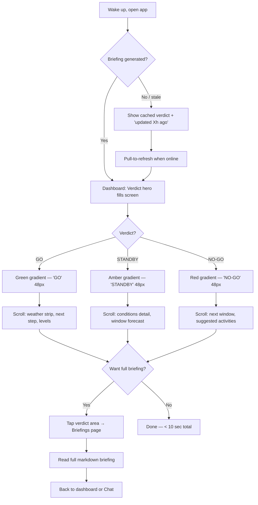
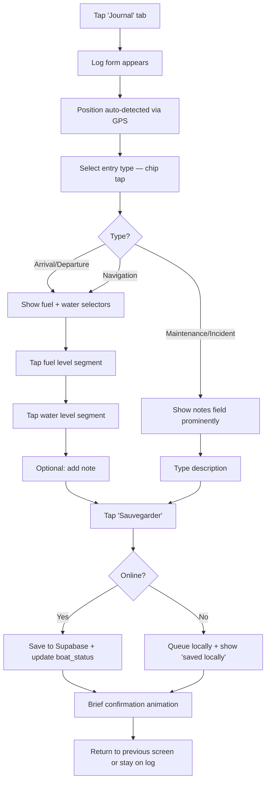
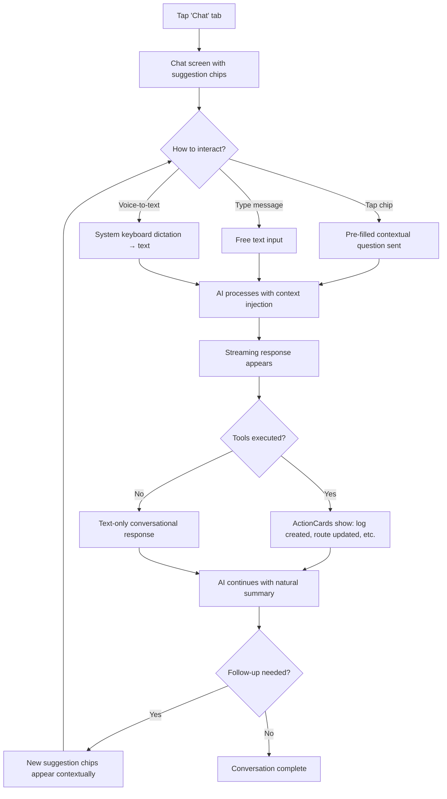
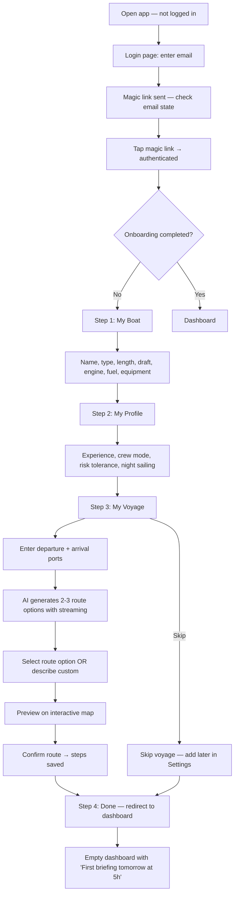
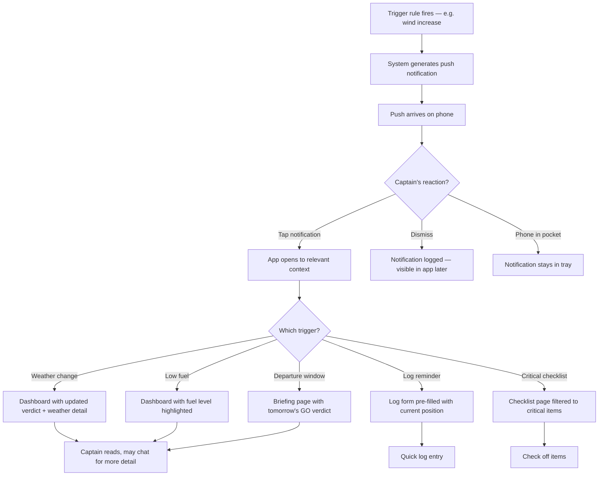
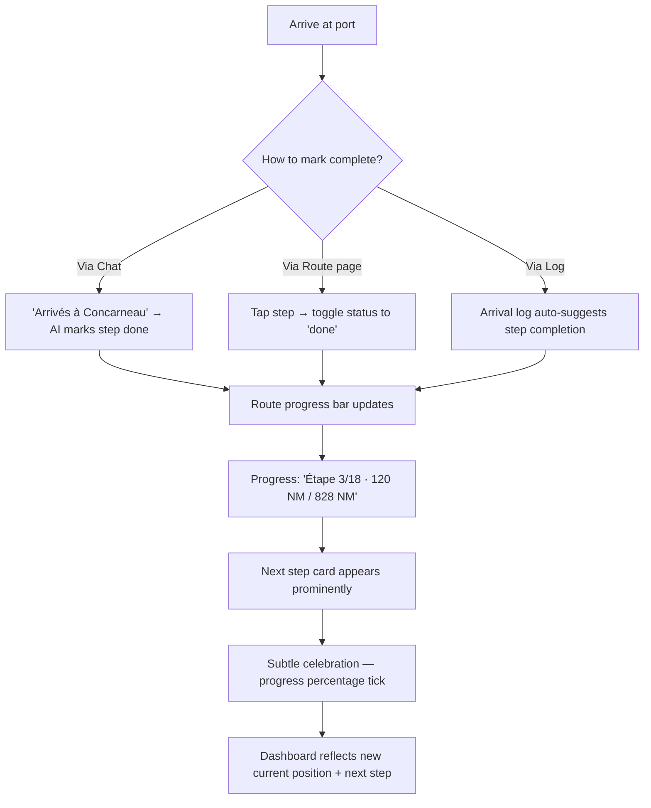

# UX Design Specification — Bosco

**Author:** Seb
**Date:** 2026-03-01

---

<!-- UX design content will be appended sequentially through collaborative workflow steps -->

## Executive Summary

### Project Vision

Bosco is a proactive AI sailing first mate — not a navigation tool, but an intelligent crew member that monitors, anticipates, and speaks to the captain when something needs attention. It centralizes weather, tides, map, logbook, checklist, and route tracking in a single mobile-optimized PWA with an AI copilot (Claude) producing daily GO/STANDBY/NO-GO verdicts and intervening proactively during the day.

The core UX principle: **complexity is in the AI prompt, simplicity is in the interface.** The captain should interact with Bosco like talking to a real first mate — naturally, quickly, and with trust.

### Target Users

**Primary: Solo navigator (Sébastien archetype)**
- Experienced sailor on multi-week convoy passages
- Uses phone one-handed in cockpit, often tired, sometimes in challenging conditions (rain, night, cold)
- Intermittent coastal 4G connectivity, sometimes no connection
- Expects direct, skipper-to-skipper communication — no hand-holding
- Critical constraint: cognitive load is a safety factor in solo sailing

**Secondary: Beta testers (sailing friends)**
- Range from coastal day sailors to long-distance cruisers
- Each configures own boat, profile, and voyage
- Varying experience levels — AI adapts tone and thresholds accordingly

### Key Design Challenges

1. **Cockpit-first design** — Phone in one hand, wet/gloved fingers, direct sunlight or darkness, fatigue after 12+ hours sailing. Every interaction must be achievable with minimal cognitive load and maximum touch target sizes (≥44px).

2. **Information hierarchy under pressure** — The critical question ("Should I leave today?") must be answered in <10 seconds. Secondary information (weather details, fuel levels, route progress) should be available but never compete with the verdict.

3. **Offline-first resilience** — The app must never show blank screens. Cached data with "updated X ago" indicators, pre-generated briefings readable offline, log entries queued locally. The sailor must trust the app to work regardless of connectivity.

4. **Proactive vs. passive UX** — The first mate pushes information via notifications and dashboard alerts. The UI must surface proactive messages without creating notification fatigue. The balance between "helpful crew member" and "annoying alarm system" is critical.

5. **Agentic AI transparency** — The chat uses 7 tools with up to 5 agentic turns. Tool execution must be visible enough for trust but not so verbose that it overwhelms the conversation flow.

### Design Opportunities

1. **Verdict as hero moment** — The daily GO/STANDBY/NO-GO verdict is the primary user motivation. It deserves an immersive, emotionally resonant presentation — full-color, large typography, swipeable details.

2. **Chat as unified interface** — Since the AI can create logs, manage checklists, update routes, and set reminders, the chat could serve as a command center with contextual shortcuts, reducing navigation complexity.

3. **Spatial-first navigation** — For sailors, position is the primary mental reference. The map could serve as a richer navigation hub with contextual overlays (weather, next step, fuel range) rather than being a secondary view.

4. **Progressive disclosure** — Complex data (full briefing markdown, 20-leg route details, checklist categories) should be presented in layers: summary → details on demand. This matches the cockpit context where quick glances are the norm.

## Core User Experience

### Defining Experience

The core experience of Bosco is the **daily verdict ritual**: every morning, the captain opens the app and knows in under 10 seconds whether to cast off or stay in port. This single interaction defines the product's value proposition and must be the most polished, most reliable, most emotionally resonant moment in the entire app.

Everything else — logging, chatting, route tracking, checklists — serves this core loop. The AI first mate proactively maintains the context (via triggers, memory, and background processing) so that the verdict is always accurate and the captain always trusts it.

The secondary core experience is **conversational command**: the captain tells the first mate what happened ("arrived in Lorient, fueled up, autopilot fixed") and the AI handles the data entry (log, route update, checklist, boat status). The interface adapts to the captain, not the other way around.

### Platform Strategy

| Aspect | Decision | Rationale |
|--------|----------|-----------|
| Platform | PWA (Progressive Web App) | No app store dependency, installable, offline-capable |
| Primary device | Android phone (360-412px) | Sébastien's device, most common among sailors |
| Input mode | Touch (one-handed, thumb-only) | Cockpit constraint — one hand on tiller/wheel |
| Orientation | Portrait only | One-handed operation, consistent layout |
| Connectivity | Offline-first with sync | Coastal 4G is intermittent, open sea has none |
| Display conditions | High contrast required | Direct sunlight + night mode (red tint for night vision) |
| Touch precision | Low (wet/gloved fingers, boat motion) | Minimum 48px touch targets, generous spacing, no small icons |

### Effortless Interactions

**1. Zero-tap verdict** — The app opens directly to the verdict. No login screen (session persists), no loading spinner (cached briefing), no navigation required. GO/STANDBY/NO-GO fills the screen above the fold.

**2. Three-tap logging** — Entry type chip → fuel/water quick selector → save. GPS position auto-detected, timestamp auto-filled, previous levels pre-loaded as defaults. Offline-queued transparently.

**3. Natural language command** — "Arrivés à Lorient, plein fait, pilote auto réparé" → AI creates log entry, updates boat status (position, fuel, nav_status), checks off autopilot on checklist, updates route step to "done", and confirms in one message. The captain describes reality; the AI handles the bookkeeping.

**4. Glanceable weather** — Wind speed, direction, sea height, and trend visible without scrolling. Uses familiar Beaufort scale notation (F4, F5) alongside knots. Color-coded: green (comfortable), amber (attention), red (dangerous) relative to the sailor's profile.

**5. Proactive push** — The first mate sends push notifications only when actionable: weather change, departure window, low fuel, forgotten log. Never "informational" pushes. Each notification opens directly to the relevant context.

### Critical Success Moments

1. **First briefing moment** — The user completes onboarding, and the next morning receives their first personalized briefing with a verdict tailored to their boat, route, and profile. This is the conversion moment from "trying an app" to "trusting a crew member."

2. **Accurate verdict validation** — The captain checks actual conditions against the verdict and finds it matches reality. This builds the trust loop that keeps them coming back every morning. One bad verdict erodes trust significantly.

3. **Proactive alert in context** — A push notification arrives during sailing with actionable information ("Wind increasing to F6, briefing said F4. Fallback: Concarneau at 12NM, 2h30 at current speed"). This is the moment the AI transitions from "tool" to "crew member."

4. **Effortless log completion** — After a long watch, the captain logs position, fuel, and conditions in under 20 seconds from the cockpit. No frustration, no complex forms, no lost data.

5. **Chat problem-solving** — The captain asks "engine overheating, what do I check?" and receives a structured diagnostic checklist specific to their engine type, with the option to log the issue and create maintenance checklist items — all from the same conversation.

### Experience Principles

| # | Principle | Description | Design Implication |
|---|-----------|-------------|-------------------|
| 1 | **Verdict first, always** | The GO/STANDBY/NO-GO verdict is the reason the app exists. It must dominate every morning interaction. | Verdict is full-screen above the fold on dashboard. Everything else is below or in tabs. |
| 2 | **Act first, confirm after** | The AI takes action proactively and confirms what it did. Never asks permission for routine operations. | Chat shows action summaries, not confirmation dialogs. Tool execution is visible but non-blocking. |
| 3 | **Cockpit-grade simplicity** | Every screen must be usable with one wet hand on a moving boat in direct sunlight or total darkness. | 48px+ touch targets, high contrast, no hover states, no small text, no precise gestures. |
| 4 | **Offline is normal** | No connection is an expected state, not an error. The app works with cached data and syncs transparently. | Never show "no connection" errors. Show "updated 3h ago" instead. Queue all writes locally. |
| 5 | **Progressive disclosure** | Show the minimum needed, reveal details on demand. The captain scanning from the cockpit needs headlines; at anchor, they want the full briefing. | Summary cards that expand. Swipeable detail layers. Collapsible sections. |
| 6 | **Trust through transparency** | The AI always shows its data sources, confidence level, and reasoning. The captain is responsible for decisions — the AI provides recommendations. | Briefings cite sources. Verdict shows confidence. Weather data is timestamped. |

## Desired Emotional Response

### Primary Emotional Goals

| Priority | Emotion | Description | Why It Matters |
|----------|---------|-------------|----------------|
| 1 | **Serene confidence** | "My first mate has been watching. I can trust the verdict." | Trust is the foundation. Without it, the captain reverts to manual multi-source checking, defeating the product's purpose. |
| 2 | **Quiet mastery** | "I have all the information. I understand the situation. I decide." | The captain must remain the decision-maker. The AI recommends; the human commands. Empowerment, not dependency. |
| 3 | **Relief** | "I don't need to juggle 6 apps and 3 weather sites anymore." | Cognitive load reduction is the core value proposition. The emotional payoff is the absence of stress, not the presence of excitement. |
| 4 | **Companionship** | "I'm solo but not alone. My second has my back." | Solo sailing is psychologically demanding. The AI's proactive nature — checking weather, reminding about logs, suggesting fallback ports — creates a sense of crew presence. |

### Emotional Journey Mapping

| Stage | Target Emotion | Design Strategy | Anti-Pattern |
|-------|---------------|-----------------|-------------|
| **Discovery / Onboarding** | Curiosity + "made for me" | Boat-specific setup, familiar nautical language, quick time-to-value (first briefing within 24h) | Generic tech onboarding, overwhelming forms, "powered by AI" marketing speak |
| **First briefing** | Impressed trust | Personalized content referencing their boat name, route, and conditions. Sources cited. Professional markdown formatting. | Generic weather summary, no personalization, AI hallucination |
| **Morning verdict (GO)** | Confident anticipation | Large green verdict, clear departure window, concise action plan. Feels like a crew meeting. | Buried verdict among other data, information overload, ambiguous recommendation |
| **Morning verdict (NO-GO)** | Accepting respect | Clear explanation of why, suggested activities while waiting, forecast for when conditions improve. Feels like honest counsel. | Blaming tone, no alternatives, making the captain feel stupid for wanting to leave |
| **Quick log in cockpit** | Fluid satisfaction | 3-tap completion, haptic confirmation, "saved" animation. Feels like ticking a box, not filling a form. | Long forms, required fields, error states for minor omissions |
| **Chat conversation** | Warm complicity | First-person voice, nautical idioms, proactive actions, occasional dry humor. Feels like talking to an experienced mate. | Corporate bot tone, "I'm an AI assistant", excessive caveats, asking permission before acting |
| **Proactive alert at sea** | Grateful security | Concise push notification with specific data + action. Opens directly to relevant context. Feels like a crew member calling from the bow. | Alarm sounds, vague alerts, "weather may change", no actionable info |
| **Offline mode** | Calm continuity | Cached data displays seamlessly with "updated X ago" timestamp. No error banners. Feels like reading a paper chart. | "No connection" errors, blank screens, disabled features, red warning banners |
| **System error** | Understanding tolerance | Honest explanation, fallback to cached data, suggestion to retry. Feels human and recoverable. | Cryptic error codes, blame on user, lost data, no recovery path |
| **Route step completed** | Proud accomplishment | Progression bar updates, distance traveled accumulates, celebratory but restrained feedback. Feels like marking the chart. | No acknowledgment, stats buried, overly enthusiastic confetti/gamification |

### Micro-Emotions

| Spectrum | Target State | Critical Because | Design Lever |
|----------|-------------|-----------------|-------------|
| **Confidence ↔ Skepticism** | Confidence | One incorrect verdict breaks the trust loop for weeks. Every data point must be traceable. | Cite sources in briefings. Show forecast model names. Display "confidence: high/medium/low". Timestamp all data. |
| **Calm ↔ Anxiety** | Calm | The app must reduce stress, never add to it. Sailors already manage enough anxiety. | Reserve red exclusively for NO-GO and genuine danger. Use amber sparingly. Green = comfortable, not just "good". No flashing, no alarm sounds, no uppercase warnings. |
| **Accomplishment ↔ Frustration** | Accomplishment | Every interaction should end with the captain feeling productive, not fighting the interface. | Confirm saves visually. Show progression. Celebrate milestones subtly (leg completed, voyage percentage). |
| **Complicity ↔ Coldness** | Complicity | Solo sailing is lonely. The AI should feel like crew, not software. | Use "tu" (informal French). Reference boat name. Remember past conversations. Use nautical terminology naturally. Occasional dry humor when appropriate. |
| **Serenity ↔ Overwhelm** | Serenity | Information overload is a safety risk at sea. Cognitive fatigue leads to bad decisions. | Progressive disclosure everywhere. Headlines first, details on demand. No more than 3 data points visible at once without scrolling. |

### Design Implications

| Emotion Goal | Design Decision |
|-------------|----------------|
| Serene confidence | Verdict uses full-width color block (green/amber/red) with large typography. No competing visual elements above the fold. Confidence badge visible. |
| Quiet mastery | Data is presented as "here's what I found" not "here's what to do". Decision language: "Recommended" not "Required". Captain always has override context. |
| Relief | Single app replaces Windy + Météo France + VHF + paper logbook + Navionics + Notion. Every feature reduces a previous manual step. Onboarding highlights "you used to do X, now Bosco does it." |
| Companionship | Push notifications use first-person voice ("Hey capitaine, le vent monte"). Chat remembers previous conversations. AI uses the boat's name. Proactive check-ins feel like a mate asking "tout va bien ?" |
| Calm (not anxiety) | Red is reserved for NO-GO and genuine danger only. Weather color coding is relative to the sailor's profile (F5 is amber for a beginner, green for an experienced sailor). No flashing elements. No sound alerts in the app itself. |
| Accomplishment | Route progress shows NM traveled and % completed. Log entries show a running count. Checklist shows completion rate. Each voyage has a clear "start → current → finish" arc. |
| Complicity | Chat uses French nautical idioms. AI refers to the captain by informal "tu". Tool executions are summarized humanly ("J'ai noté ton arrivée à Lorient et mis à jour la route"). Memory system means the AI never asks the same question twice. |

### Emotional Design Principles

| # | Principle | Manifesto Statement |
|---|-----------|-------------------|
| 1 | **Trust is earned in drops, lost in buckets** | Every interaction either deposits or withdraws from the trust account. Accurate verdicts deposit. Hallucinated data bankrupts. Design for accuracy over impressiveness. |
| 2 | **Calm is the product** | The entire UX should lower the captain's stress level. If any screen or interaction raises anxiety, it's a bug. This includes error states, loading states, and offline states. |
| 3 | **Crew, not software** | The AI personality is a character — a competent, experienced, slightly dry-humored first mate. Not a chatbot. Not an assistant. A crew member who happens to live in the phone. |
| 4 | **Silence is golden** | The best notification is one that didn't need to be sent. Only interrupt the captain for actionable, time-sensitive information. Every unnecessary push erodes the signal-to-noise ratio. |
| 5 | **Celebrate the journey** | A multi-week convoy is an adventure. The app should mark progress, remember milestones, and make the captain feel the voyage arc. Not gamification — genuine acknowledgment. |

## UX Pattern Analysis & Inspiration

### Inspiring Products Analysis

#### 1. Windy (Weather)
- **What it does well:** Dense weather visualization through layered map overlays. Scrubbable timeline for 7-day forecast evolution. Became the default weather app for sailors.
- **Key UX pattern:** Information density without overload — achieved through layers (toggle wind/waves/rain) and temporal scrubbing (slide through hours). The user controls depth of exploration.
- **Limitation for Bosco:** Zero contextual intelligence. The sailor must manually cross-reference data with their boat specs, route, and conditions. Bosco's AI eliminates this cognitive step.

#### 2. Strava (Activity Tracking)
- **What it does well:** Creates a daily ritual. Open → immediate activity state. Celebrates progression (segments, PRs, badges) without being childish. The social feed creates accountability.
- **Key UX pattern:** The habit loop — open app → see state → feel accomplished → close. Each session deposits in the engagement bank. Progression visualization (distance, elevation, streaks) makes abstract effort tangible.
- **Transferable to Bosco:** Route progression as an "activity feed" — each completed leg is a visible accomplishment. NM traveled, sailing days, voyage percentage create the same satisfaction loop. But restrained — no badges, no gamification. Just honest progress tracking.

#### 3. ChatGPT Mobile App (AI Chat)
- **What it does well:** Radical simplicity — one text field, one send button, streaming responses. Prompt suggestions lower the barrier to first message. Clean, fast, distraction-free.
- **Key UX pattern:** The blank canvas with guardrails — empty chat + suggestion chips guide without constraining. Streaming text creates a sense of real-time conversation.
- **Limitation for Bosco:** No actions — ChatGPT is conversational only. Bosco's chat must show tool executions (log created, route updated) transparently without breaking the conversational flow.
- **Transferable to Bosco:** Streaming UX, suggestion chips adapted to sailing context ("Briefing du jour", "État carburant", "Prochaine étape"). But extend with action confirmation cards inline.

#### 4. Apple Weather (Information Hierarchy)
- **What it does well:** Impeccable hierarchy — the most important information (current temperature, conditions) is the largest element. Details available by scrolling. Color gradients communicate emotional context (blue = calm, orange = alert).
- **Key UX pattern:** Hero data + progressive scroll. No tabs, no navigation for the primary use case. Just open → see → done.
- **Transferable to Bosco:** The verdict should follow this exact pattern. Full-screen color gradient (green/amber/red) with verdict text dominating above the fold. Weather details, route info, fuel levels below the fold via scroll. The morning ritual should be: open → see verdict → done (or scroll for details).

#### 5. Navionics / Boating (Nautical Reference)
- **What it does well:** Comprehensive nautical charts with offline support. Tide/current overlays. Port information database. The reference app for marine navigation.
- **Key UX pattern:** Offline as a first-class feature — download chart zones, navigate without connection. The user expects this to work at sea.
- **Anti-pattern for Bosco:** Complex desktop-oriented interface crammed onto mobile. Too many icons, too many layers, too many options. Designed for chartplotters, not cockpits. Bosco must be the opposite — mobile-first, simplified, AI-curated.

### Transferable UX Patterns

#### Navigation Patterns

| Pattern | Source | Application in Bosco | Rationale |
|---------|--------|---------------------|-----------|
| **Hero data above the fold** | Apple Weather | Verdict fills the screen. No navigation needed for the primary use case. | Matches the "10-second verdict" core experience. |
| **Progressive scroll** | Apple Weather, Strava | Dashboard: verdict → weather → fuel/water → route → mate messages. All on one scrollable page. | Eliminates tab-switching for the morning ritual. Everything in reading order. |
| **Layered map overlays** | Windy | Map with toggleable overlays: route, weather, tides, ports. Each layer adds depth without clutter. | Sailors think spatially. The map becomes an information hub. |
| **Bottom sheet** | Google Maps, Apple Maps | Swipe-up bottom sheet over map for step details, weather data, or quick actions. | Maintains spatial context while showing details. One-handed operation. |

#### Interaction Patterns

| Pattern | Source | Application in Bosco | Rationale |
|---------|--------|---------------------|-----------|
| **Suggestion chips** | ChatGPT | Context-aware chips above chat input: "Briefing du jour", "Météo Lorient", "Log rapide". | Reduces typing on phone. Provides entry points for common actions. |
| **Streaming response** | ChatGPT | AI responses stream token by token. Tool calls appear as inline action cards. | Creates conversational feel. Shows the AI is "thinking" and "doing". |
| **Quick-tap selectors** | iOS Health | Fuel/water levels as large, tappable segmented chips (Full/3-4/Half/1-4/Reserve) instead of sliders. | Gloved fingers can't operate sliders. Discrete choices with large targets. |
| **Swipe to complete** | Strava, Things 3 | Swipe a route step to mark as "done". Swipe a checklist item to check off. | Fast, satisfying, one-handed gesture. Reduces taps. |
| **Pull to refresh** | Universal | Pull-to-refresh on dashboard to update weather. With haptic feedback. | Familiar gesture. Gives user control over data freshness. |

#### Visual Patterns

| Pattern | Source | Application in Bosco | Rationale |
|---------|--------|---------------------|-----------|
| **Full-screen color blocks** | Apple Weather gradients | Verdict card: solid green/amber/red gradient filling the top of the screen. Not a small badge — the entire ambient color. | Communicates verdict emotionally before reading text. Glanceable from 2 meters. |
| **Monochrome + accent** | Apple Weather, Things 3 | Dark mode: gray backgrounds, white text, color only for verdict and status indicators. | Reduces visual noise. Makes the important colors (GO green, STANDBY amber, NO-GO red) pop. |
| **Timeline visualization** | Windy, Strava | Route progress as a horizontal or vertical timeline. Past = solid, current = pulsing, future = dashed. | Gives spatial sense of journey progress. Familiar pattern from travel apps. |
| **Contextual color** | Strava zones | Weather parameters color-coded relative to sailor's profile: wind that's fine for a pro is amber for a beginner. | Personalized safety communication. Same data, different urgency per user. |

### Anti-Patterns to Avoid

| Anti-Pattern | Source | Why to Avoid | Bosco Alternative |
|-------------|--------|-------------|-------------------|
| **Desktop-on-mobile** | Navionics | Tiny icons, dense toolbars, multi-level menus. Unusable with one wet hand. | Touch-first design. No toolbars. Maximum 5 bottom tabs. |
| **Information dump** | Navionics, weather apps | Showing all data at once without hierarchy. The user must parse what matters. | AI-curated summaries. Verdict first, details on demand. |
| **Confirmation dialogs** | Enterprise apps | "Are you sure?" interrupts flow and implies distrust. | Act first, undo after. Soft undo for destructive actions. No permission dialogs for routine operations. |
| **Small touch targets** | Most marine apps | Buttons < 44px, close-together icons, precise gestures. | Minimum 48px targets, generous spacing, no precision required. |
| **Verbose tool feedback** | POC Bosco chat | "update_memory", "manage_checklist x10" raw tool badges. Exposes implementation details. | Human-readable summaries: "J'ai ajouté 10 items à ta checklist de sécurité." |
| **Error-as-failure** | Most apps | "Network error", "Something went wrong", red banners. Creates anxiety. | Graceful degradation: "Données mises à jour il y a 3h. Actualisation dès le retour du réseau." |
| **Notification spam** | Most apps | Push for every event, including informational. Creates fatigue and ignore-all behavior. | Only actionable, time-sensitive pushes. "Silence is golden" principle. |

### Design Inspiration Strategy

**Adopt directly:**
- Hero verdict above the fold (Apple Weather pattern)
- Suggestion chips in chat (ChatGPT pattern)
- Streaming AI responses (ChatGPT pattern)
- Offline-first as default state (Navionics pattern)
- Quick-tap selectors for levels (iOS Health pattern)

**Adapt for Bosco:**
- Strava's progression tracking → route voyage timeline (restrained, no gamification)
- Windy's layered map → simplified with AI-curated overlays (not user-configurable layers)
- Google Maps bottom sheet → swipe-up detail panel over map context
- ChatGPT's blank canvas → pre-loaded with last conversation context + contextual chips

**Deliberately avoid:**
- Navionics' desktop complexity → cockpit simplicity
- Raw tool_use feedback → human-readable action summaries
- Confirmation dialogs → act first, confirm after
- Information dumps → AI-curated progressive disclosure
- Notification spam → actionable-only pushes

## Design System Foundation

### Design System Choice

**Selected:** Tailwind CSS 4 + shadcn/ui component primitives, heavily customized for cockpit-first mobile use.

**Category:** Themeable system with full customization — shadcn/ui provides accessible, unstyled primitives (via Radix UI) that are copied into the project and fully owned. Not a dependency, but a starting point.

### Rationale for Selection

| Factor | Assessment | Score |
|--------|-----------|-------|
| **Speed of development** | Copy-paste components, no learning curve for Tailwind users | High |
| **Customization depth** | Full ownership of every component — can resize, restyle, restructure | Full |
| **Accessibility** | Radix UI primitives handle ARIA, keyboard nav, focus management | Built-in |
| **Dark mode** | CSS variable theming, integrates with existing ThemeProvider | Native |
| **Mobile-first** | No desktop assumptions — components are unstyled primitives | Excellent |
| **Bundle size** | Tree-shakeable, only import what's used | Minimal |
| **Maintenance** | Components live in project — no upstream breaking changes | Low risk |
| **Community** | Massive Next.js + Tailwind ecosystem, extensive documentation | Strong |

**Why not alternatives:**
- **Pure custom:** No accessible primitives. Would need to implement ARIA, focus traps, keyboard nav from scratch. Not worth the effort for Dialog, Sheet, Select, Tabs.
- **Material UI:** Desktop-first design language. Touch targets too small by default. Bundle size too large. Opinionated visual style conflicts with Bosco's nautical identity.
- **Chakra UI:** Good mobile support but adds its own styling system alongside Tailwind — unnecessary complexity.

### Implementation Approach

**Phase 1 — Design Tokens (CSS Variables)**

```css
/* Verdict colors — the emotional core */
--color-go: #22C55E;
--color-standby: #F59E0B;
--color-nogo: #EF4444;

/* Ocean palette — calm, professional */
--color-ocean-50: #f0f9ff;
--color-ocean-500: #0ea5e9;
--color-ocean-900: #0c4a6e;

/* Semantic surface colors */
--color-surface: white;           /* light mode */
--color-surface-dark: #111827;    /* dark mode (gray-900) */
--color-surface-elevated: #f9fafb; /* light mode cards */
--color-surface-elevated-dark: #1f2937; /* dark mode cards */

/* Typography scale — cockpit-readable */
--text-xs: 0.875rem;    /* 14px — minimum for any text */
--text-sm: 1rem;         /* 16px — body text */
--text-base: 1.125rem;   /* 18px — emphasized body */
--text-lg: 1.25rem;      /* 20px — section headers */
--text-xl: 1.5rem;       /* 24px — page headers */
--text-2xl: 2rem;        /* 32px — verdict text */
--text-hero: 3rem;       /* 48px — verdict word (GO/NO-GO) */

/* Spacing — generous for touch */
--touch-target: 48px;    /* minimum interactive element size */
--spacing-touch: 12px;   /* minimum gap between interactive elements */

/* Border radius — slightly rounded, not bubbly */
--radius-sm: 8px;
--radius-md: 12px;
--radius-lg: 16px;
--radius-full: 9999px;   /* pills, chips */
```

**Phase 2 — Component Selection from shadcn/ui**

| Component | Use In Bosco | Customization |
|-----------|-------------|---------------|
| `Button` | All CTAs, log save, chat send | 48px min height, full-width on mobile, verdict-colored variants |
| `Card` | Dashboard cards, route steps, briefing cards | Generous padding, high-contrast borders in light mode |
| `Sheet` (bottom drawer) | Map details, quick actions, level updates | Swipe-up from bottom, 60% viewport height, drag handle |
| `Dialog` | Confirmations (delete only), onboarding steps | Large touch targets, simple yes/no, no complex forms in dialogs |
| `Tabs` | Checklist categories, settings sections | Scrollable horizontal tabs, large labels, active state clear |
| `Badge` | Verdict (GO/STANDBY/NO-GO), status indicators, entry type | Large size (28px+ height), high contrast, pill shape |
| `Select` | Entry type, boat type, experience level | Native mobile select for accessibility, custom styled trigger |
| `Skeleton` | Loading states throughout | Pulse animation, matches card dimensions |
| `ScrollArea` | Chat history, briefing content, route list | Smooth momentum scrolling, overscroll bounce |
| `Separator` | Section dividers | Subtle, light gray, 1px |

**Not using from shadcn/ui:**
- `Tooltip` — no hover states in mobile
- `Menubar` — no desktop menu patterns
- `NavigationMenu` — using custom BottomNav instead
- `Slider` — using tap selectors for fuel/water (cockpit constraint)
- `Table` — using card-based layouts instead

**Phase 3 — Custom Cockpit Components (built on primitives)**

| Component | Description | Not in shadcn/ui |
|-----------|-------------|-----------------|
| `VerdictHero` | Full-width color gradient with verdict text, confidence badge, glanceable weather | Core Bosco component |
| `LevelSelector` | 5-segment tap selector (Full/3-4/Half/1-4/Reserve) with visual fill | Replaces slider for cockpit use |
| `WeatherCard` | Compact wind/wave/visibility with Beaufort notation and trend arrow | Sailing-specific |
| `RouteTimeline` | Vertical timeline with phase colors, status icons, distance labels | Voyage-specific |
| `ChatBubble` | Message bubble with tool action cards, streaming indicator | Extended for agentic AI |
| `ActionCard` | Inline chat card showing tool execution result ("Log créé", "Route mise à jour") | Agentic AI specific |
| `SuggestionChip` | Contextual quick-action chips above chat input | Sailing-context specific |
| `ProgressRing` | Circular fuel/water gauge with level color | Maritime dashboard |
| `MiniMap` | Non-interactive Leaflet preview with route overlay | Already exists, to be refined |

### Customization Strategy

**Typography:** System font stack (`-apple-system, BlinkMacSystemFont, 'Segoe UI'`) — fastest loading, best rendering on mobile. No custom fonts. Minimum 14px for any text, 16px for body text, 48px for verdict hero text.

**Color philosophy:** Monochrome base (grays) with 3 semantic accent colors (GO green, STANDBY amber, NO-GO red) and 1 navigation accent (ocean blue). Dark mode inverts grays, keeps semantic colors identical. No decorative colors.

**Spacing philosophy:** Generous. 16px base padding on cards. 12px minimum gap between interactive elements. 48px minimum height for any tappable element. No cramming — if it doesn't fit, use progressive disclosure.

**Animation philosophy:** Minimal. Skeleton pulse for loading. Subtle fade for transitions. No sliding, bouncing, or decorative animation. Motion sickness is real on a moving boat.

**Icon philosophy:** Lucide React icons (already in project). 24px minimum size. Paired with text labels — never icon-only for primary actions. Color only for status (verdict colors).

## Defining Core Experience

### The Defining Interaction

**"Open the app, know if you sail."**

Bosco's defining experience is the **instant verdict**: the captain opens the app and sees GO, STANDBY, or NO-GO in under 10 seconds. No navigation, no login, no loading. The verdict is the app.

This is comparable to:
- **Tinder:** "Swipe to match" — one gesture, immediate result
- **Spotify:** "Search and play" — instant access to what you need
- **Apple Weather:** "Open and see temperature" — zero-interaction information

For Bosco: **"Open and see verdict"** — the captain's morning ritual reduced to a glance.

### User Mental Model

**Current workflow (without Bosco):**

| Step | App/Source | Time | Cognitive Load |
|------|-----------|------|---------------|
| 1 | Windy | 3-5 min | Parse wind maps, identify trends |
| 2 | Météo France | 2-3 min | Compare models, check BMS alerts |
| 3 | Tide app | 1-2 min | Check times, calculate windows |
| 4 | Navionics | 2-3 min | Review next leg, identify dangers |
| 5 | Personal notes | 2-3 min | Check fuel, water, problems, checklist |
| 6 | Mental synthesis | 3-5 min | Cross-reference all data, decide |
| **Total** | **5-6 sources** | **15-30 min** | **High — multiple apps, mental cross-referencing** |

**With Bosco:**

| Step | Interface | Time | Cognitive Load |
|------|-----------|------|---------------|
| 1 | Open app | 0 sec | Zero — cached briefing loads instantly |
| 2 | See verdict | 2 sec | Minimal — color + word (GO/NO-GO) |
| 3 | Scroll for details (optional) | 10-30 sec | Low — curated summary, not raw data |
| **Total** | **1 app** | **2-30 sec** | **Minimal — AI did the cross-referencing** |

**Mental model shift:** From "I gather data and decide" to "My second presents a recommendation and I confirm or dig deeper." The captain retains authority but delegates analysis.

### Success Criteria

| Criterion | Metric | How to Measure |
|-----------|--------|---------------|
| **Instant verdict** | < 2 seconds from app open to visible verdict | Cached briefing, no spinner, no API call |
| **Verdict accuracy** | > 80% of verdicts judged "correct" by captain | Post-voyage survey, compare verdict vs actual conditions |
| **Time to decision** | < 10 seconds for the morning ritual | From app open to "I know if I sail" |
| **Trust building** | Captain opens app every morning without checking other sources | Usage analytics — daily active opens |
| **Effortless logging** | < 20 seconds per log entry | From tap "new entry" to tap "save" |
| **Chat usefulness** | Captain uses chat for real decisions (not just testing) | Chat history shows operational questions, not novelty |
| **Proactive value** | Captain acts on at least 1 push notification per week | Push open rate + subsequent action in app |

### Novel UX Patterns

**Pattern 1: Verdict-as-Interface**

Not a dashboard with a status badge — the verdict IS the interface. The entire top section of the screen becomes a colored field (green/amber/red) with the verdict word in hero typography. This is novel for sailing apps, borrowed from ambient computing (smart home status lights).

**Mechanics:**
- Full-width gradient: `bg-gradient-to-b from-green-500/20 to-transparent` (GO), amber for STANDBY, red for NO-GO
- Verdict word centered: 48px hero font, bold
- Confidence badge below: "Confiance haute" / "Confiance moyenne"
- Timestamp: "Briefing de 05:12"
- Tap anywhere on verdict → navigates to full briefing

**Pattern 2: Conversational Command**

The chat doesn't just answer questions — it takes actions. This extends the ChatGPT pattern with visible tool execution. Novel for sailing apps, adapted from agentic AI patterns.

**Mechanics:**
- Captain types: "Arrivés à Concarneau, 3/4 carburant, RAS"
- AI streams response while executing tools
- Inline ActionCards appear: "Log créé" (green check), "Route mise à jour: étape 1 → terminée" (blue check), "Position: Concarneau" (map pin)
- AI text wraps up: "Bien noté ! Concarneau → Lorient sera ta prochaine étape, 28 NM. Tu veux que je regarde la météo pour demain ?"
- All actions happened without the captain navigating to Log, Route, or Boat Status pages

**Pattern 3: Ambient Weather**

Weather isn't a separate page — it's embedded in context everywhere. Dashboard shows it, briefing explains it, chat answers about it, map overlays it. The sailor never needs to "go to weather" — weather comes to them, pre-analyzed for their route and boat.

**Mechanics:**
- Dashboard: compact weather strip below verdict (wind icon + "18 kn S", wave icon + "1.8m", eye icon + "24km")
- Color-coded per sailor profile: 18 kn S might be green for an experienced solo, amber for a beginner
- Trend arrow: ↗ (increasing), → (stable), ↘ (decreasing)
- Tap on weather strip → expandable detail panel or link to full briefing section

### Experience Mechanics: The Morning Ritual

**1. Initiation (automatic)**
- Captain taps Bosco icon on home screen
- App opens to dashboard (session persisted, no login)
- Cached briefing renders instantly (generated at 5am, stored locally)

**2. Verdict consumption (2 seconds)**
- Full-screen verdict gradient visible immediately
- "GO" in 48px green font (or STANDBY amber, NO-GO red)
- "Confiance haute" badge below
- "Briefing de 05:12" timestamp
- The captain's question is answered: "Yes, I sail today"

**3. Detail exploration (optional, 10-30 seconds)**
- Scroll down for weather summary (wind, waves, visibility)
- Continue scrolling for fuel/water levels, route step, mate messages
- Tap verdict area → full briefing page with markdown content
- Each section is a card, progressively disclosed

**4. Action (if GO)**
- Captain already knows the plan from the verdict
- Optionally checks full briefing for departure time and waypoints
- Goes to cockpit, starts preparations
- Later: opens chat to log departure ("On largue les amarres")

**5. Action (if NO-GO)**
- Captain reads the "why" in the briefing
- Sees when conditions might improve ("Fenêtre possible mercredi")
- Optionally chats: "Et si je pars à 14h plutôt que 8h ?"
- Closes app, plans shore activities

### Experience Mechanics: Quick Log

**1. Initiation**
- Tap "Journal" in bottom tab → "Nouvelle entrée" button
- OR from chat: "Arrivé à Lorient" → AI creates log via tool

**2. Interaction (3 taps)**
- Entry type: 5 large chips (Navigation/Arrivée/Départ/Maintenance/Incident) — tap one
- Position: auto-detected by GPS, displayed as port name, editable
- Fuel: 5 large segments (Full/3-4/Half/1-4/Reserve) — tap one
- Water: same 5 segments — tap one
- Notes: optional text field (not required)
- Everything else auto-filled: date/time, last known position as default

**3. Feedback**
- "Sauvegardé" confirmation with subtle check animation
- If offline: "Sauvegardé localement, synchronisation au retour du réseau"
- Boat status auto-updated (fuel level, position, nav_status)

**4. Completion**
- Return to log history showing the new entry at top
- Route progression updated if departure/arrival type
- Dashboard reflects new levels

### Experience Mechanics: Chat Conversation

**1. Initiation**
- Tap "Chat" in bottom tab
- Last conversation visible (persistent history)
- Suggestion chips above input: "Briefing du jour", "Météo [next port]", "État du bateau"
- OR: start typing in the input field

**2. Interaction**
- Type message or tap chip
- AI response streams in real-time (token by token)
- If tools execute: inline ActionCards appear within the response
- ActionCard format: icon + action description + status (success/error)
- Multiple tool calls appear as a grouped summary, not individual badges

**3. Feedback**
- Streaming text shows the AI is "thinking"
- ActionCards confirm what was done (not what will be done)
- Human-readable summaries: "J'ai créé une entrée de log pour ton arrivée à Lorient et mis à jour la route. Étape 1 terminée, prochaine: Lorient → Le Croisic (55 NM)."
- If max turns reached: graceful message explaining limit, not a raw error

**4. Completion**
- Response complete, input ready for next message
- Suggestion chips update based on context (if route was updated, might show "Météo Le Croisic")
- Chat history persists across sessions

## Visual Design Foundation

### Color System

#### Semantic Palette

| Token | Light Mode | Dark Mode | Usage |
|-------|-----------|-----------|-------|
| `--background` | `#FFFFFF` | `#0F172A` (slate-900) | Page background |
| `--surface` | `#F8FAFC` (slate-50) | `#1E293B` (slate-800) | Card backgrounds |
| `--surface-elevated` | `#FFFFFF` | `#334155` (slate-700) | Elevated cards, sheets |
| `--border` | `#E2E8F0` (slate-200) | `#334155` (slate-700) | Card borders, dividers |
| `--text-primary` | `#0F172A` (slate-900) | `#F8FAFC` (slate-50) | Headings, primary text |
| `--text-secondary` | `#64748B` (slate-500) | `#94A3B8` (slate-400) | Labels, secondary text |
| `--text-muted` | `#94A3B8` (slate-400) | `#64748B` (slate-500) | Timestamps, metadata |

#### Verdict Colors (The Emotional Core)

| Verdict | Foreground | Background (light) | Background (dark) | Gradient |
|---------|-----------|-------------------|-------------------|----------|
| **GO** | `#16A34A` (green-600) | `#F0FDF4` (green-50) | `#052E16` (green-950) | `from-green-500/20 to-transparent` |
| **STANDBY** | `#D97706` (amber-600) | `#FFFBEB` (amber-50) | `#451A03` (amber-950) | `from-amber-500/20 to-transparent` |
| **NO-GO** | `#DC2626` (red-600) | `#FEF2F2` (red-50) | `#450A0A` (red-950) | `from-red-500/20 to-transparent` |

These colors are ONLY used for verdict-related elements. No other UI element uses green, amber, or red to avoid false signals.

#### Accent Color (Navigation & Interactive)

| Token | Value | Usage |
|-------|-------|-------|
| `--accent` | `#0EA5E9` (sky-500) | Active tab, links, interactive highlights |
| `--accent-foreground` | `#FFFFFF` | Text on accent backgrounds |
| `--accent-subtle` | `#F0F9FF` (sky-50) / `#0C4A6E` (sky-900) | Accent tinted backgrounds |

Ocean blue (sky-500) was chosen because:
- Nautical association — evokes sea and sky
- High contrast against all three verdict colors
- Distinct from status colors (not green, amber, or red)
- Works equally well in light and dark mode

#### Status Colors (Non-Verdict)

| Status | Color | Usage |
|--------|-------|-------|
| Route done | `--text-muted` (gray) | Completed steps, past entries |
| Route current | `--accent` (sky-500) | Active step, pulsing indicator |
| Route future | `--border` (slate-200/700) | Upcoming steps, dashed lines |
| Offline | `--text-secondary` | "Updated 3h ago" timestamp |
| Phase: Atlantic | `#3B82F6` (blue-500) | Route phase color |
| Phase: Gironde | `#8B5CF6` (violet-500) | Route phase color |
| Phase: Canal | `#22C55E` (green-500) | Route phase color (distinct from GO — used in map/route only) |
| Phase: Mediterranean | `#F97316` (orange-500) | Route phase color |

#### Checklist Category Colors

| Category | Color | Usage |
|----------|-------|-------|
| Safety | `#EF4444` (red-500) | Category badge, priority indicator |
| Propulsion | `#F97316` (orange-500) | Category badge |
| Navigation | `#3B82F6` (blue-500) | Category badge |
| Rigging | `#EAB308` (yellow-500) | Category badge |
| Comfort | `#22C55E` (green-500) | Category badge |
| Admin | `#6B7280` (gray-500) | Category badge |

These colors appear only on small badges/pills within the checklist context, never as background fills.

#### Dark Mode Strategy

- **Default mode:** Dark (sailors often use phones at night; OLED power saving)
- **Toggle:** Dark / Light / System (persisted to localStorage)
- **Map tiles:** CartoDB Dark Matter (dark) / OpenStreetMap (light) + OpenSeaMap overlay (both)
- **Color inversion:** Background/surface/text invert. Verdict colors, accent, and status colors remain identical in both modes.
- **Night mode (future consideration):** Red-tinted mode for preserving night vision. Not in MVP but architecture should support a third color scheme.

### Typography System

#### Font Stack

```css
font-family: -apple-system, BlinkMacSystemFont, 'Segoe UI', Roboto, 'Helvetica Neue', Arial, sans-serif;
```

System fonts — zero loading time, native rendering, optimal legibility on each platform.

#### Type Scale

| Token | Size | Weight | Line Height | Usage |
|-------|------|--------|-------------|-------|
| `text-hero` | 48px (3rem) | 800 (extrabold) | 1.0 | Verdict word (GO / NO-GO) |
| `text-2xl` | 32px (2rem) | 700 (bold) | 1.2 | Page titles |
| `text-xl` | 24px (1.5rem) | 600 (semibold) | 1.3 | Section headers |
| `text-lg` | 20px (1.25rem) | 600 (semibold) | 1.4 | Card titles, emphasis |
| `text-base` | 18px (1.125rem) | 400 (normal) | 1.5 | Body text (emphasized) |
| `text-sm` | 16px (1rem) | 400 (normal) | 1.5 | Standard body text |
| `text-xs` | 14px (0.875rem) | 400 (normal) | 1.4 | Captions, timestamps, metadata |

**Minimum text size: 14px.** Nothing smaller exists in the app. Cockpit readability at arm's length requires at least 14px.

#### Text Color Hierarchy

| Level | Light Mode | Dark Mode | Usage |
|-------|-----------|-----------|-------|
| Primary | slate-900 | slate-50 | Headlines, body text, values |
| Secondary | slate-500 | slate-400 | Labels, descriptions |
| Muted | slate-400 | slate-500 | Timestamps, metadata, inactive |
| Inverse | white | slate-900 | Text on colored backgrounds |

### Spacing & Layout Foundation

#### Spacing Scale

| Token | Value | Usage |
|-------|-------|-------|
| `space-1` | 4px | Inline text gaps, icon-to-label |
| `space-2` | 8px | Tight component padding |
| `space-3` | 12px | Standard component padding, gap between related items |
| `space-4` | 16px | Card padding, section gaps |
| `space-5` | 20px | Between cards, section margins |
| `space-6` | 24px | Page horizontal padding |
| `space-8` | 32px | Between major sections |
| `space-10` | 40px | Page top padding (below header) |
| `space-12` | 48px | Touch target minimum height |

#### Layout Principles

**Single column:** The entire app is a single-column layout. No side-by-side panels, no split views. Mobile is a single column — don't fight it.

**Safe areas:** Full safe area support for iOS notch and Android navigation bar. `env(safe-area-inset-top)`, `env(safe-area-inset-bottom)`.

**Bottom nav height:** 56px + safe area inset. Includes 5 tabs with 48px touch targets.

**Page structure:**
```
┌─────────────────────┐
│ Status bar (system)  │  — safe-area-inset-top
├─────────────────────┤
│ Page header (opt.)   │  — 48px height, page title + actions
├─────────────────────┤
│                     │
│   Scrollable        │  — flex-1, overflow-y-auto
│   Content           │  — padding: 16px horizontal, 20px between cards
│                     │
├─────────────────────┤
│ Bottom Nav          │  — 56px + safe-area-inset-bottom
└─────────────────────┘
```

**Card structure:**
```
┌─────────────────────┐
│  16px padding       │
│  ┌───────────────┐  │
│  │ Title (lg)    │  │  — 20px font, semibold
│  │ Subtitle (xs) │  │  — 14px font, muted color
│  ├───────────────┤  │
│  │               │  │
│  │ Content       │  │  — 16-18px body text
│  │               │  │
│  └───────────────┘  │
│  16px padding       │
└─────────────────────┘
```

#### Touch Target Specifications

| Element | Min Width | Min Height | Min Gap |
|---------|-----------|-----------|---------|
| Primary button | 100% (full-width) | 48px | 12px above/below |
| Icon button | 48px | 48px | 8px between |
| Tab bar item | 20% viewport | 48px | 0 (edge-to-edge) |
| Chip/badge (tappable) | 64px | 40px | 8px between |
| List item (tappable) | 100% | 56px | 0 (divider between) |
| Input field | 100% | 48px | 12px above/below |

### Accessibility Considerations

#### Contrast Ratios (WCAG AA minimum)

| Context | Requirement | How Achieved |
|---------|-------------|-------------|
| Body text on background | ≥ 4.5:1 | slate-900 on white = 15.4:1; slate-50 on slate-900 = 15.4:1 |
| Large text (≥24px) on background | ≥ 3:1 | All verdict colors on their respective backgrounds exceed 3:1 |
| Interactive elements | ≥ 3:1 against adjacent | sky-500 on white = 3.4:1; sky-500 on slate-900 = 4.9:1 |
| Verdict text on gradient | ≥ 4.5:1 | Dark verdict text on light gradient backgrounds; light on dark |

#### Additional Accessibility

- **No color-only indicators:** Verdict always includes text (GO/STANDBY/NO-GO) alongside color. Never rely on color alone.
- **Focus indicators:** Visible 2px ring in accent color for keyboard/screen reader navigation.
- **Reduced motion:** Respect `prefers-reduced-motion` — disable pulse animations, use instant transitions.
- **Screen reader:** All interactive elements have descriptive `aria-label`. Verdict includes full context ("Verdict: GO, confiance haute, briefing de 05:12").
- **Font scaling:** Layout accommodates up to 150% system font scaling without breaking.

## Design Direction Decision

### Direction Exploration

Three design directions were explored for the dashboard (the most critical screen):

#### Direction A: "Verdict Immersif" (Recommended — Score: 19/21)

Full-screen verdict with color gradient (green GO / amber STANDBY / red NO-GO). Hero text at 48px, confidence level, briefing time. Secondary information (weather, levels, route) below the fold via progressive scroll.

**Strengths:** Instant verdict recognition (< 2 seconds), emotional impact through color gradient, Apple Weather-proven pattern (hero data + progressive scroll), perfect cockpit readability (large text, few elements), supports all 3 emotional states naturally.

#### Direction B: "Command Center" (Score: 12/21)

Compact verdict (32px) with 2x2 metric grid. Dense instrument-panel layout with all data visible immediately.

**Weaknesses:** Verdict loses emotional impact, too dense for cockpit use, high cognitive load with 6+ data points visible, feels utilitarian rather than companion-like.

#### Direction C: "Card Stack" (Score: 16/21)

Autonomous cards in vertical flow. Verdict in first card, then weather, then route. Modern "mobile-native" style.

**Strengths:** Clean, modern, extensible. **Weaknesses:** Verdict loses impact as "one card among many", gaps waste vertical space, no strong emotional hierarchy.

### Selected Direction

**Direction A "Verdict Immersif"** with elements borrowed from Direction C:
- Rounded card style (border-radius: 16px) for below-fold sections
- 3-column weather grid layout from Direction C

### Rationale

| Criterion | Direction A Score | Why |
|-----------|------------------|-----|
| Verdict in < 10 sec | ★★★ | Full-screen hero, instant recognition |
| Emotional impact | ★★★ | Color gradient creates mood before reading |
| Cockpit readability | ★★★ | Large text, minimal elements |
| One-handed use | ★★★ | Simple vertical scroll |
| Progressive disclosure | ★★★ | Hero → scroll → tap |
| Offline resilience | ★★★ | Cached verdict = fully functional |
| Information density | ★★☆ | Trade-off: detail below fold (acceptable) |

### Shared Screen Designs

#### Chat Screen

- **ActionCards** replace raw tool badges — human-readable summaries with status icons
- Multiple actions grouped visually (not scattered as individual badges)
- Contextual suggestion chips (change based on last conversation/position)
- Conversational AI text using informal tone, referencing boat by name
- Dark and light mode support

#### Log Entry Screen

- Entry type selection via chips (Navigation, Arrival, Departure, Maintenance, Incident)
- Fuel/water levels via segmented selector (48px touch targets): Full / 3/4 / Half / 1/4 / Reserve
- Auto-detected GPS position display
- Single "Save" button (48px height, full width, ocean blue)
- Optimized for 3-tap cockpit entry

### Interactive Mockups

Full interactive mockups available at: `_bmad-output/planning-artifacts/ux-design-directions.html`

## User Journey Flows

### Journey 1: Morning Ritual (Verdict Check)

**Trigger:** Captain wakes up, reaches for phone
**Goal:** Know in < 10 seconds if today is a sailing day
**Frequency:** Every morning, 05:00–07:00
**Context:** Cabin or cockpit, possibly groggy, phone brightness low

**Flow:**



**Key Design Decisions:**
- Verdict visible without ANY interaction (no tap, no scroll)
- Color gradient communicates answer before text is read
- Offline: cached verdict displays seamlessly, no error state
- Tap on verdict area = shortcut to full briefing
- Weather strip shows 3 data points max above fold

**Success Metric:** Verdict understood in < 2 seconds. Full dashboard scan in < 10 seconds.

---

### Journey 2: Quick Log (Cockpit Entry)

**Trigger:** Arrival at port, departure, position check, or incident
**Goal:** Record position + levels in < 20 seconds
**Frequency:** 2-5x daily while sailing
**Context:** Cockpit, one hand, possibly wet, boat moving

**Flow:**



**Key Design Decisions:**
- GPS auto-fills position — zero input for location
- Entry type via chip selector — single tap, no dropdown
- Fuel/water via segmented control (5 levels) — single tap each
- Minimum path: 3 taps (type + fuel + save) = < 20 seconds
- Notes are optional, never blocking
- Offline save is silent and transparent — no warning modal

**Success Metric:** Arrival log completed in 3 taps / < 20 seconds.

---

### Journey 3: Chat Command (Natural Language)

**Trigger:** Captain wants to log, ask, or command something
**Goal:** Describe reality in natural language, AI handles all bookkeeping
**Frequency:** 3-10x daily
**Context:** Cockpit or cabin, conversational tone

**Flow:**



**Example Flow — "Arrivés à Lorient, plein fait, pilote auto réparé":**

| Step | What Happens | User Sees |
|------|-------------|-----------|
| 1 | Message sent | User bubble appears |
| 2 | AI streams response | Text builds progressively |
| 3 | 5 tools execute | 5 ActionCards: log, position, fuel, checklist, route |
| 4 | AI summarizes | "Noté ! Étape 3 terminée. Prochaine: Lorient → Belle-Île, 25 NM." |
| 5 | New chips appear | "Météo Belle-Île" / "Checklist départ" / "Briefing demain" |

**Key Design Decisions:**
- Suggestion chips are contextual (change based on position, time, last action)
- ActionCards replace raw tool badges — human-readable with status icons
- Multiple tool executions grouped visually, not scattered
- AI never asks permission for routine ops — acts first, confirms after
- Streaming response for perceived speed

**Success Metric:** Single natural language message triggers all relevant updates. Zero manual form-filling needed.

---

### Journey 4: First-Time Onboarding

**Trigger:** User signs up / first app open
**Goal:** Configure boat + profile + route, get first briefing within 24h
**Frequency:** Once
**Context:** At home or at dock, calm, full attention available

**Flow:**



**Key Design Decisions:**
- Magic link = no password to remember (critical for sailors)
- 4 steps, clearly numbered with progress indicator
- Boat setup uses sensible defaults for sailboat dimensions
- AI route generation shows streaming progress (not a blank loading screen)
- Route selection uses cards with pros/cons, not a bare list
- Map preview lets user validate before committing
- Skip is always available — no forced completion
- First briefing generates at next 5am cron — set expectation clearly

**Success Metric:** Onboarding completed in < 10 minutes. First briefing received next morning.

---

### Journey 5: Proactive Alert at Sea

**Trigger:** System detects condition change (weather, fuel, log gap)
**Goal:** Captain receives actionable information without asking
**Frequency:** 0-3x daily (only when relevant)
**Context:** Sailing, possibly in cockpit, phone may be in pocket

**Flow:**



**Key Design Decisions:**
- Push notifications are ONLY actionable — never informational noise
- Each notification deep-links to the relevant screen
- Notification text uses first-person voice: "Le vent monte à F6, 12 NM de Concarneau"
- Max 3 notifications per day — respect attention budget
- Never send between 22:00 and 06:00 unless safety-critical

**Success Metric:** Every push notification leads to a useful action. Zero "why did I get this?" moments.

---

### Journey 6: Route Step Completion

**Trigger:** Captain arrives at a waypoint port
**Goal:** Mark step as done, see progress update
**Frequency:** Every 1-3 days while sailing
**Context:** Just docked, relieved, wanting to mark achievement

**Flow:**



**Key Design Decisions:**
- Three ways to complete a step (chat, route page, log) — no single forced path
- Chat is the most natural: describing arrival auto-completes the step
- Progress bar is persistent — visible on dashboard and route page
- Celebration is restrained (progress tick, not confetti) — matches sailing sobriety
- Next step is immediately visible after completion

**Success Metric:** Step marked complete with zero dedicated UI interaction (via natural chat message).

---

### Journey Patterns

#### Navigation Patterns

| Pattern | Usage | Implementation |
|---------|-------|---------------|
| **Tab-based navigation** | Primary app sections | 5-tab BottomNav: Accueil, Route, Journal, Chat, Plus |
| **Deep-link from push** | Notification → relevant screen | Each trigger type maps to a specific route |
| **Back to dashboard** | After any task completion | Dashboard is always the "home" return point |
| **Progressive drill-down** | Verdict → briefing → detail | Tap on summary to expand, never modal |

#### Decision Patterns

| Pattern | Usage | Implementation |
|---------|-------|---------------|
| **Chip selection** | Entry type, route options | Single-tap pill buttons, visually distinct active state |
| **Segmented control** | Fuel/water levels | 5-segment bar, each segment = one tap |
| **Card selection** | Route proposals, settings | Cards with pros/cons, tap to select |
| **Implicit decision** | Chat → AI acts | No confirmation dialog, action summary after |

#### Feedback Patterns

| Pattern | Usage | Implementation |
|---------|-------|---------------|
| **ActionCard** | Tool execution in chat | Green card with icon + human-readable summary |
| **Progress bar** | Route completion | Horizontal bar with step count + NM |
| **Timestamp** | Data freshness | "Updated 3h ago" instead of error |
| **Brief animation** | Save confirmation | Subtle checkmark/pulse, < 500ms |

### Flow Optimization Principles

| # | Principle | Application |
|---|-----------|-------------|
| 1 | **Minimum taps to value** | Morning verdict: 0 taps. Quick log: 3 taps. Chat command: 1 message. |
| 2 | **Multiple paths, same result** | Route step completion via chat, route page, or log entry. User picks natural path. |
| 3 | **Smart defaults** | GPS auto-fills position. Fuel defaults to last known. Entry type defaults to "Navigation". |
| 4 | **Transparent offline** | Queue writes silently. Show cached reads with timestamp. Never block the user. |
| 5 | **Contextual shortcuts** | Chat chips change based on position/time. Dashboard cards link to relevant actions. |
| 6 | **Act first, confirm after** | AI executes tools immediately, shows ActionCards. No "Are you sure?" dialogs. |
| 7 | **Restrained celebration** | Progress tick on step completion. No gamification, no badges, no streaks. Respect the sailor's seriousness. |

## Component Strategy

### Design System Components (shadcn/ui)

Components adopted from shadcn/ui (Radix UI primitives + Tailwind):

| Component | shadcn/ui Name | Bosco Usage | Customization |
|-----------|---------------|-------------|---------------|
| Button | `Button` | Save, confirm, navigation actions | 48px min-height, rounded-xl, ocean blue primary |
| Card | `Card` | Dashboard cards, briefing cards, settings sections | 16px radius, dark: slate-800, light: white + border |
| Badge | `Badge` | Verdict confidence, route phase, entry type | Verdict colors (GO/STANDBY/NO-GO) + phase colors |
| Dialog | `Dialog` | Delete confirmation, route option detail | Bottom sheet on mobile (drawer variant) |
| Sheet | `Sheet` | More menu items, filter panels | Side=bottom for mobile drawer pattern |
| Tabs | `Tabs` | Checklist categories, settings sections | Scrollable horizontal, 48px touch targets |
| Skeleton | `Skeleton` | Loading states for all data cards | Pulse animation, matches card dimensions |
| ScrollArea | `ScrollArea` | Chat messages, briefing content, log history | Custom scrollbar hidden on mobile |
| Separator | `Separator` | Section dividers in settings, route steps | Subtle slate-700/200 |
| Toggle | `Toggle` | Push notification toggle, night sailing toggle | 48px touch target, ocean blue active |

### Custom Components

#### VerdictHero

**Purpose:** Full-screen verdict display — THE defining component of Bosco
**Usage:** Dashboard above-the-fold, always visible on app open

| Property | Spec |
|----------|------|
| Layout | Full-width, min-height 280px, centered content |
| Background | Linear gradient: verdict color at 25% opacity → transparent |
| Verdict text | 48px, weight 800, letter-spacing 2px, verdict color |
| Route name | 16px, weight 600, foreground color |
| Confidence | 14px, muted color (slate-400) |
| Timestamp | 12px, muted-foreground (slate-500) |
| States | GO (green-600), STANDBY (amber-600), NO-GO (red-600) |
| Tap action | Navigate to latest briefing detail |
| Offline | Shows cached verdict + "updated Xh ago" in timestamp |
| A11y | `role="status"`, `aria-label="Verdict: GO, confiance haute, briefing de 05:12"` |

#### WeatherStrip

**Purpose:** Compact horizontal weather summary below verdict
**Usage:** Dashboard, below VerdictHero

| Property | Spec |
|----------|------|
| Layout | Flex row, centered, gap 16px, padding 12px 16px |
| Items | 3 max: Wind (speed + direction), Waves (height + period), Visibility |
| Typography | Icon 16px + value 14px bold + unit 14px regular |
| Color coding | Green/amber/red relative to sailor profile thresholds |
| A11y | `aria-label="Vent 12 noeuds sud-ouest, vagues 1.2 mètres période 8 secondes, visibilité 24 kilomètres"` |

#### LevelBar

**Purpose:** Fuel/water level indicator with labeled bar
**Usage:** Dashboard levels card, log entry display

| Property | Spec |
|----------|------|
| Layout | Label (12px, icon + text) + progress bar (8px height, rounded) |
| Fill colors | > 50%: sky-500, 25-50%: amber-500, < 25%: red-500 |
| Background | Dark: slate-700, Light: slate-200 |
| Variants | `compact` (dashboard), `full` (settings) |

#### LevelSelector

**Purpose:** Segmented control for fuel/water input
**Usage:** Log form, quick log

| Property | Spec |
|----------|------|
| Layout | Flex row, 5 equal segments, gap 4px |
| Segments | "Plein" / "3/4" / "Moitié" / "1/4" / "Rés." |
| Height | 48px per segment (touch target) |
| Active state | sky-500/20 background, sky-500 border + text |
| Inactive | Dark: slate-700 + slate-500 border, Light: slate-100 + slate-200 border |
| A11y | `role="radiogroup"`, each segment `role="radio"` with `aria-checked` |

#### TypeChips

**Purpose:** Single-select chip group for categorical selection
**Usage:** Log entry type, route phase filter

| Property | Spec |
|----------|------|
| Layout | Flex wrap, gap 8px |
| Chip size | min-height 40px, padding 10px 16px, rounded-full |
| Selected | sky-500 background, white text |
| Unselected | Dark: slate-700 + slate-500 border, Light: slate-100 + slate-200 border |
| A11y | `role="radiogroup"`, chips as `role="radio"` |

#### ActionCard

**Purpose:** Display AI tool execution result in chat
**Usage:** Chat messages when AI executes tools

| Property | Spec |
|----------|------|
| Layout | Flex row, icon + text, padding 8px 12px, rounded-lg |
| Background | Dark: green-950, Light: green-50 |
| Icon | Checkmark (green-500), 16px |
| Text | 12px, green-500, human-readable action summary |
| Grouping | Multiple ActionCards stack vertically with 4px gap |
| A11y | `role="status"`, `aria-label="Action effectuée: Log créé — Arrivée à Concarneau"` |

#### SuggestionChip

**Purpose:** Contextual quick-action buttons in chat
**Usage:** Chat screen, above input bar

| Property | Spec |
|----------|------|
| Layout | Horizontal scroll row, gap 8px, padding 8px 16px |
| Chip | padding 6px 14px, rounded-full, border |
| Style | Dark: slate-700 bg + slate-500 border, Light: slate-100 + slate-200 border |
| Tap | Sends chip text as user message |
| Contextual | Chips change based on position, time of day, last conversation |
| A11y | `role="button"`, `aria-label` with full action text |

#### RouteStepCard

**Purpose:** Display a single route leg with status
**Usage:** Dashboard (next step), Route page (all steps)

| Property | Spec |
|----------|------|
| Layout | Flex row: dot (12px circle) + info (name + detail) + badge |
| Dot color | sky-500 (upcoming), green-500 (done), slate-500 (future) |
| Name | 14px, weight 500, foreground |
| Detail | 12px, muted (distance, duration, phase) |
| Badge | Step count "3/18", rounded-full, small |
| Tap action | Route page: toggle step status. Dashboard: navigate to route page |

#### MateMessage

**Purpose:** Proactive AI message card on dashboard
**Usage:** Dashboard, below route/levels when AI has something to say

| Property | Spec |
|----------|------|
| Layout | Left border 3px sky-500, padding 12px, rounded-r-lg |
| Background | sky-500/10 |
| Text | 14px, muted color, conversational tone |
| Tap action | Navigate to chat with context |

#### BottomNav

**Purpose:** Primary app navigation
**Usage:** App shell, persistent on all screens

| Property | Spec |
|----------|------|
| Layout | Fixed bottom, 5 equal tabs, height 83px (includes safe area) |
| Tabs | Accueil, Route, Journal, Chat, Plus |
| Icons | 24px, Lucide icon set |
| Active | sky-500 color |
| Inactive | slate-500 color |
| Touch target | Full tab width, 48px+ height |
| Safe area | `padding-bottom: env(safe-area-inset-bottom)` |

### Component Implementation Strategy

| Layer | Source | Count | Notes |
|-------|--------|-------|-------|
| **Primitives** | shadcn/ui (Radix) | 10 | Button, Card, Badge, Dialog, Sheet, Tabs, Skeleton, ScrollArea, Separator, Toggle |
| **Custom cockpit** | Built on Tailwind tokens | 9 | VerdictHero, WeatherStrip, LevelBar, LevelSelector, TypeChips, ActionCard, SuggestionChip, RouteStepCard, MateMessage |
| **Layout** | Custom | 1 | BottomNav |
| **Composition** | Page-level | 12 | Dashboard, Chat, Log, Route, etc. (inline in page.tsx) |

**Principles:**
- All custom components use the same CSS variable tokens as shadcn/ui
- No component > 150 lines — extract sub-components if needed
- Every component supports dark/light via Tailwind `dark:` classes
- Every interactive component has 48px minimum touch target
- Every component has explicit ARIA attributes

### Implementation Roadmap

**Phase 1 — Core (blocks all pages):**
1. `BottomNav` — app shell navigation
2. `VerdictHero` — dashboard above-the-fold
3. `Card` (shadcn) — universal container
4. `Button` (shadcn) — all actions
5. `Badge` (shadcn) — verdict, phases, status

**Phase 2 — Dashboard + Log:**
6. `WeatherStrip` — dashboard weather summary
7. `LevelBar` — dashboard fuel/water display
8. `LevelSelector` — log form input
9. `TypeChips` — log entry type selection
10. `RouteStepCard` — dashboard next step + route page
11. `MateMessage` — dashboard AI message

**Phase 3 — Chat + Polish:**
12. `ActionCard` — chat tool execution display
13. `SuggestionChip` — chat contextual shortcuts
14. `Skeleton` (shadcn) — loading states everywhere
15. `Dialog/Sheet` (shadcn) — confirmations + drawers
16. `Tabs` (shadcn) — checklist categories
